# Knee Osteoarthritis Analysis with X-ray Images using Deep Convolutional Neural Networks

This code repository is the final project of the Complex Data Mining course at
Unicamp (MDC013).

## Knee Osteoarthritis

[Knee osteoarthritis](https://en.wikipedia.org/wiki/Knee_arthritis) is a
pathology that occurs due to wear on the cartilage that protects the bones in
this region from friction and impacts.

Some medical procedures are necessary to identify this pathology, such as
**X-rays** or magnetic resonance imaging, in which it is possible to assess the
loss in joint spacing, thus indicating the severity of the disease.

The severity of osteoarthritis was classified into 5 levels based on [KL
score](https://www.ncbi.nlm.nih.gov/pmc/articles/PMC4925407/), from the healthy
level to the severe level, where the greater the degree of severity, the smaller
the spacing of the joint.

- KL score:
    - Grade 0: Healthy
    - Grade 1: Doubtful 
    - Grade 2: Minimal 
    - Grade 3: Moderate 
    - Grade 4: Severe

The following image shows the different levels from [Knee Osteoarthritis Dataset
with Severity
Grading](https://www.kaggle.com/datasets/shashwatwork/knee-osteoarthritis-dataset-with-severity).

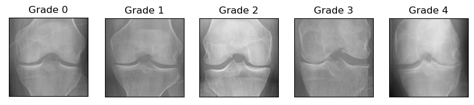

## Purpose

The purpose of this project is to correctly classify the severity of
osteoarthritis based on X-ray images.

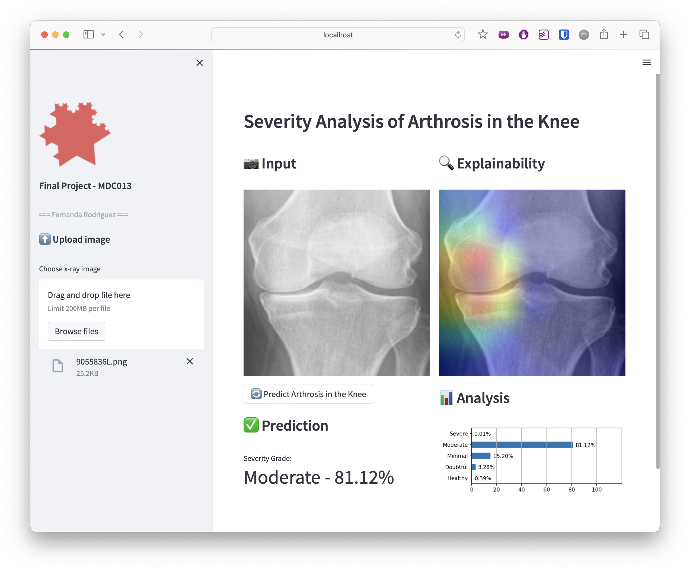

## Project Structure

```shell
.
├── README.md
├── app
│   ├── app.py
│   └── img
├── assets
├── dataset
│   ├── test
│   ├── train
│   └── val
├── environment.yml
└── src
    ├── 01_data_preparation.ipynb
    ├── 02_ensemble_models.ipynb
    ├── 02_model_inception_resnet_v2.ipynb
    ├── 02_model_resnet50.ipynb
    ├── 02_model_xception.ipynb
    ├── 03_best_model_on_test_xception.ipynb
    └── models
        └── model_Xception_ft.hdf5
```

## Project Setup

How does the Web App to **predict** knee osteoarthritis grade using **Deep
Learning** and **Streamlit** works?

### Clone this repository

```shell
(base)$: git clone git@github.com:mafda/knee_OA_dl_app.git
(base)$: cd knee_OA_dl_app
```

### Configure environment

- Create the conda environment

    ```shell
    (base)$: conda env create -f environment.yml
    ```

- Activate the environment

    ```shell
    (base)$: conda activate knee_dl_app
    ```

- Download `model_Xception_ft.hdf5` model from
   [here](https://drive.google.com/file/d/1vPS_j2AW3M1W8GydREEDw6CDENSgVwCy/view?usp=share_link)
   to run the application. Create `models` folder and copy the model here.

    ```shell
    (knee_dl_app)$: mkdir src/models
    ```

- Download the dataset from [Knee Osteoarthritis Dataset with Severity
   Grading](https://www.kaggle.com/datasets/shashwatwork/knee-osteoarthritis-dataset-with-severity)
   to train the model and test the application. Create `dataset` folder and copy
   the data here.

    ```shell
    (knee_dl_app)$: mkdir dataset
    ```

- Run it:

    ```shell
    (knee_dl_app)$: streamlit run app/app.py
    ```

    As soon as you run the script, a local Streamlit server will spin up, and
    your app will open in a new tab in your default web browser.

    Or you can navigate to `http://localhost:8501`.

## Methodology

The following methodology has been proposed to correctly classify the degree of
osteoarthritis based on X-ray images:

1. Data preparation
2. Model training
3. Model evaluation
4. Web application development with the best model

### Data preparation

The dataset consisting of 8000 X-ray images, approximately, of the knee obtained
from the [Knee Osteoarthritis
Dataset](https://www.kaggle.com/datasets/shashwatwork/knee-osteoarthritis-dataset-with-severity).

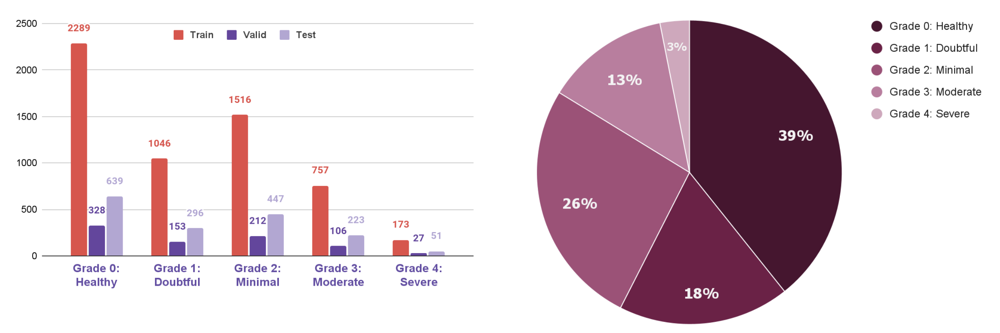

In the *bar chart* we can see the image distribution of the 5 grades (classes),
for each of the training, validation and test datasets, and in the *pie chart*
we can see the average percentage of data we have for each class. So we have an
**unbalanced** dataset.

Three strategies were implemented to reduce the impact that the unbalanced base
can have on the models:

- class weight
- data augmentation (horizontal_flip, brightness_range, width_shift_range,
  zoom_range)
- preprocessing features of pre-trained networks

> See [01_data_preparation.ipynb](src/01_data_preparation.ipynb) notebook.

### Model training

#### Pre-trained Networks

Three pre-trained networks were chosen:
[Xception](https://arxiv.org/abs/1610.02357),
[ResNet-50](https://arxiv.org/abs/1512.03385) e [Inception Resnet
v2](https://arxiv.org/abs/1602.07261v2). 

The following table presents the summary of the partial results obtained in the
implementation of the different pre-trained networks with fine tuning. Our
metrics is Balanced Accuracy. Models were trained on Apple M1 Pro chip with
8-core CPU, 14-core GPU and 16-core Neural Engine.

| Model                           | Balanced Accuracy | Time Execution |
| ------------------------------- | ----------------- | -------------- |
| Xception fine tuning            | 67%               | 68min          |
| ResNet50 fine tuning            | 65%               | 80min          |
| Inception_resnet_v2 fine tuning | 64%               | 56min          |

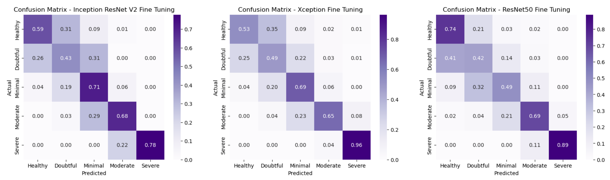

Highlighting, the highest success rate of each model by class, we have:

- Inception ResNet classified the minimal class better
- Xception classified the doubtful and severe classes better
- ResNet50 classified the healthy and moderate classes better

> See [02_model_inception_resnet_v2.ipynb](src/02_model_inception_resnet_v2.ipynb)

> See [02_model_xception.ipynb](src/02_model_xception.ipynb)

> See [02_model_resnet50.ipynb](src/02_model_resnet50.ipynb)
   
#### Ensemble

Three ensemble approaches were performed with the previous results:

- One calculating the average, and two calculating the weighted average of the
  accuracy and f1 of each class.

| Model             | Balanced Accuracy | Time Execution |
| ----------------- | ----------------- | -------------- |
| Ensemble mean     | 68.63%            | 16seg          |
| Ensemble accuracy | 68.48%            | 16seg          |
| Ensemble f1       | 68.69%            | 16seg          |

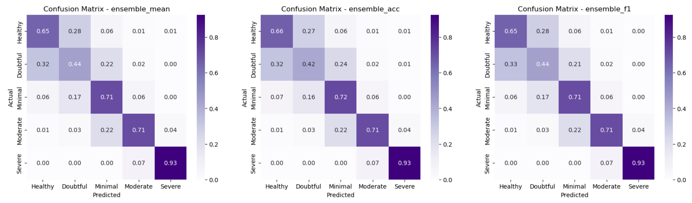

The three models had similar results, but we selected the **ensemble with f1 model**.

> See [02_ensemble_models.ipynb](src/02_ensemble_models.ipynb)

### Model evaluation

We evaluated the [best model](src/02_ensemble_models.ipynb) in the test set, a
balanced accuracy of 71% was obtained, and in the confusion matrix we can
observe the highlight of the moderate and severe classes.

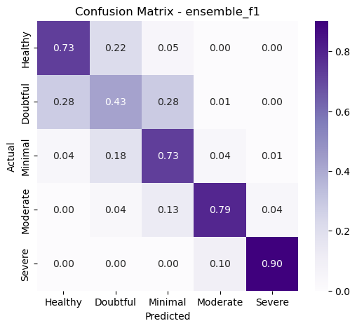

#### Explainability

We implemented the [Grad-CAM](https://arxiv.org/abs/1610.02391) explainability
technique to better understand how classes are classified. The Grad-CAM
indicates the parts of the image that most impact the classification score.

We can see in the images that for the healthy, doubtful and minimal classes, the
most prominent areas are located in the center of the knee, and the moderate and
severe classes are most prominent on the right or left edges of the knee.

Grad-CAM results were obtained from the last convolutional layer of the
[Xception](src/02_model_xception.ipynb) model.

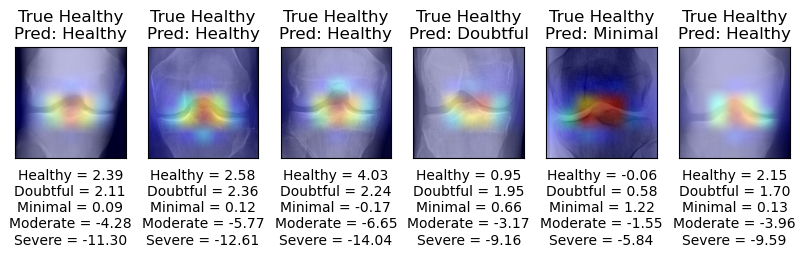
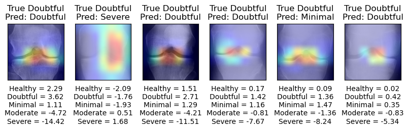
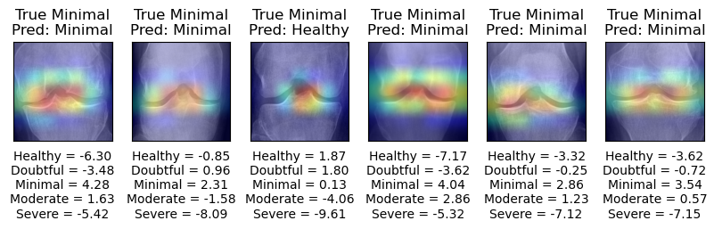
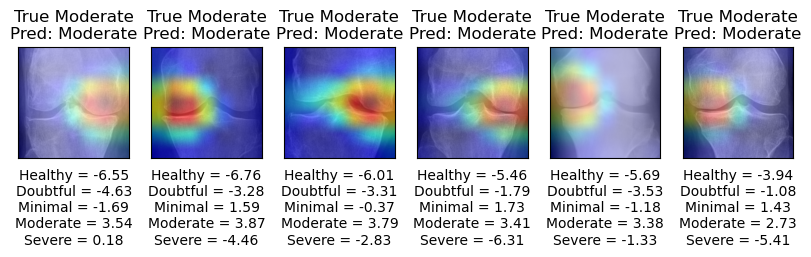
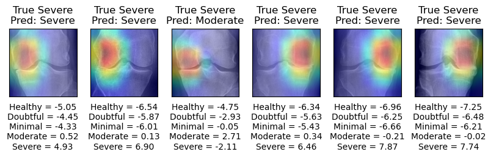

> See [03_best_model_on_test_xception.ipynb](src/03_best_model_on_test_xception.ipynb)

### Web application development with the best model

The web application allows you to select and load an X-Ray image, to later
predict and evaluate the loss in joint spacing, and indicate the probability of
disease severity, as well as the area that most impacted the classification
score.

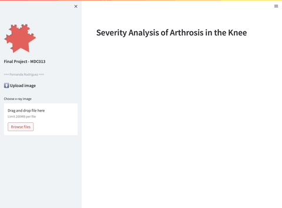

#### [pt-br] YouTube

[](https://www.youtube.com/watch?v=gl28zQAs_rk "Análise da Gravidade de Artrose no Joelho")

## References

- [Complex data mining](https://www.ic.unicamp.br/~mdc/) at
  [unicamp](https://www.unicamp.br/unicamp/).
- [Knee Osteoarthritis Dataset with Severity
  Grading](https://www.kaggle.com/datasets/shashwatwork/knee-osteoarthritis-dataset-with-severity)

---

made with 💙 by [mafda](https://mafda.github.io/)
